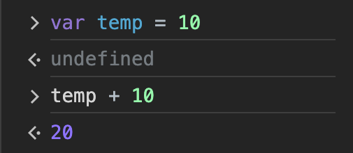

## 5장. 표현식과 문

### 💬 변수 선언문은 왜 값으로 표현될 수 없는 문인가?

```jsx
var temp = 10;
```

위와 같이 변수를 선언한다고 했을 때 초기값을 넣어준다고 해도 호이스팅에 의해 선언부만 위로 끌려 올라간다.(실제로 끌려 올라가는 것은 아니다.) 그리고 변수에 쓰레기 값이 들어있을 수도 있으니 `undefined`라는 값을 넣는다.

여기서 `undefined`라는 값을 넣어둔다. `undefined`는 ‘값’인데 변수 선언문은 표현식이 아닌 문이다. 그러니까 값으로 평가할 수 없다는 뜻인데 `undefined`라는 값이 들어있으니 값으로 평가될 수 있는게 아닌가? 라는 생각이 들었다.
<Br />

- **[1] var temp === undefined**

  ```jsx
  var temp; // undefined
  (var temp) === undefined // SyntaxError: Unexpected token 'var'
  ```

  나는 ‘변수’를 기준으로 생각을 했는데 변수를 선언하는 전체를 봐야 했다. 그러니까 위에서는 `temp`가 아닌 `var temp`를 봐야했던 것이다.
  값을 갖는 표현식으로 볼 수 있다면 위의 코드와 같이 `undefined`와 같은지 비교할 수 있어야 하는데 위에서는 문법 에러가 발생한다.
  그렇기 때문에 변수 선언문은 값으로 표현될 수 없는 문이다.<Br />

- **[2] 완료 값: Completion value**<br />
  

  표현식과 문을 구분하는 또 다른 방법은 완료 값을 보고 판단하는 것이다.
  크롬 개발자 도구에서 표현식이 아닌 문을 실행하면 언제나 `undefined`를 출력하는데 이를 **완료 값**이라고 한다. 완료 값은 표현식의 평가 결과가 아니기 때문에 다른 값과 같이 변수에 할당하거나 참조할 수 없다.
  그러니까 크롬 개발자 도구에서, 표현식이 아닌 문은 `undefined`, 표현식인 문은 평가된 값을 완료 값으로 출력한다.<Br />

<aside>
1️⃣ 표현식과 문의 차이는?

</aside>

- 표현식은 값으로 평가될 수 있는 코드 조각이고 문은 프로그램에서 어떤 작업을 수행하거나 결과를 반환하는 코드의 단위를 말한다.
- 표현식은 항상 문 안에 들어갈 수 있지만 문이 항상 표현식으로 바뀌지는 않는다.<Br />

<aside>
2️⃣ 자바스크립트에서의 세미콜론의 역할과 생략 가능성은?

</aside>

- 세미콜론은 문의 끝을 나타내는데 사용된다. 자바스크립트 엔진이 코드를 해석할 때 세미콜론을 통해 문이 종료됨을 알 수 있다.
- 자바스크립트 엔진이 자동으로 세미콜론을 입력하기 때문에 생략 가능하지만 예기치 않는 오류가 발생할 수 있으니 사용하기를 권장한다.<Br />

<aside>
3️⃣ 자바스크립트에서 표현식 문장과 선언적 문장의 차이는?

</aside>

- 표현식 문장은 값으로 평가되는 문의 형태로 사용되는 것인데 어떤 동작을 수행하거나 결과를 반환하는 경우를 말한다.
- 선언적 문장은 함수 선언문과 변수 선언문처럼 새로운 식별자를 선언할 때 사용된다.<Br />

### 🪝 참고 블로그

- https://careerly.co.kr/qnas/3431?utm_campaign=user-share
- [https://velog.io/@sangwook0613/Expression-과-Statement](https://velog.io/@sangwook0613/Expression-%EA%B3%BC-Statement)
- [모던 자바스크립트 Deep Dive](https://product.kyobobook.co.kr/detail/S000001766445)
